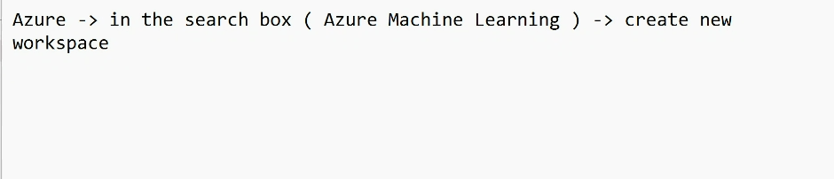

# CReate a devops on AZURE

[AI with devops](https://drive.google.com/drive/folders/1M6iPapQhGRIRd6-JkipwVjw_kmwbcHyj?usp=sharing)

https://learn.microsoft.com/en-us/azure/machine-learning/tutorial-deploy-model?view=azureml-api-2

To do It in AWS:
- Create a AWS Amazon SageMaker for single user and thenn use the AWS.ipynb to proceed

